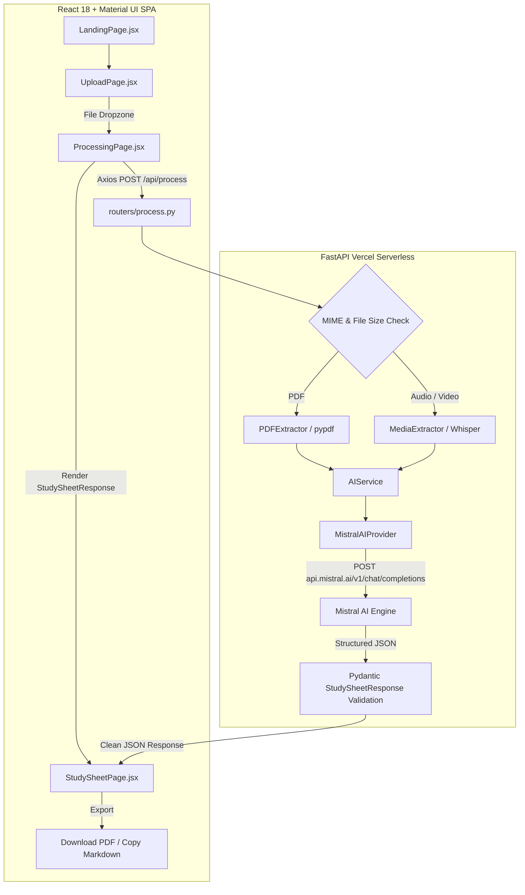
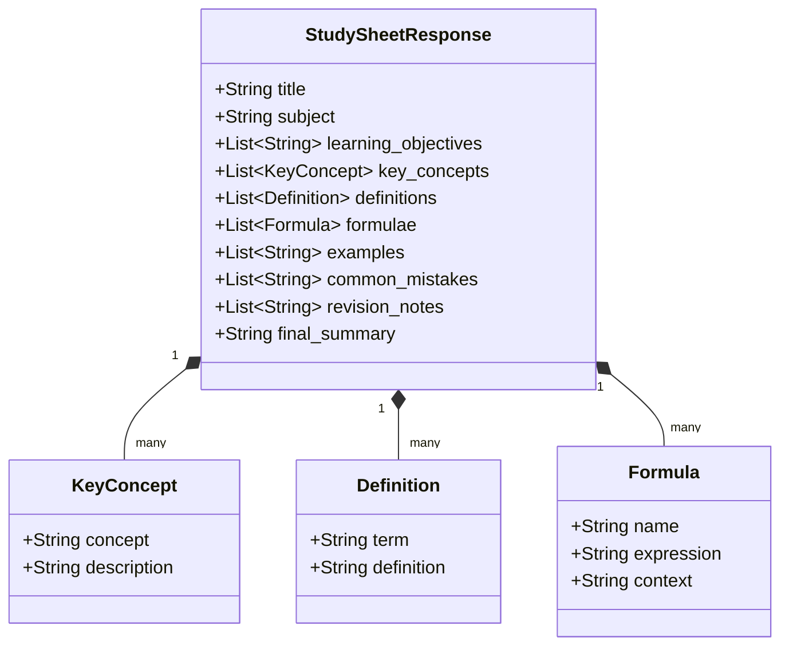

# 📘 LectureCapture AI v2 — Automated Study Sheet Generator

<p align="center">
  
  
  
  
  
</p>

<p align="center">
  <strong>Turn Video, Audio, & PDF Lectures into Concise, Exam-Ready 1-Page Study Sheets in Seconds.</strong>
</p>

<p align="center">
  🌐 <a href="https://lecturecapture-ai.vercel.app"><strong>Live Web Application</strong></a> &nbsp;|&nbsp; ⚡ <a href="https://lecturecapture-ai-backend.vercel.app/health"><strong>Live Backend API</strong></a> &nbsp;|&nbsp; 🐙 <a href="https://github.com/anuraggaur29/LectureCapture.ai"><strong>GitHub Repository</strong></a>
</p>

---

## 📌 Executive Platform Overview

**LectureCapture AI v2** is an enterprise-grade, full-stack AI application engineered to eliminate transcript bloat and note-taking fatigue for students, educators, and researchers.

Traditional AI tools generate unreadable, multi-page walls of text when processing raw lecture audio or slide decks. LectureCapture AI v2 takes raw **Video (.mp4, .webm)**, **Audio (.mp3, .wav, .m4a)**, or **PDF (.pdf)** files and synthesizes a high-yield, structured 1-to-2 page **JSON Study Sheet** (600–800 words total) focused strictly on learning objectives, core concepts, definitions, formulas, and exam traps.

### Value Proposition
- **Zero Transcript Noise**: Removes conversational filler ("um", "like", "okay") and verbal chitchat.
- **Transcript-Bound Grounding**: Enforces strict context boundaries to eliminate AI hallucinations.
- **JSON-First Architecture**: Backend emits validated data schemas; React frontend completely owns presentation.

---

## ✨ Key Technical Features

- 🎥 **Multi-Modal Ingestion**: Direct client-side file upload supporting Video (`.mp4`, `.webm`), Audio (`.mp3`, `.wav`, `.m4a`), and PDF Slide Decks (`.pdf`).
- 🤖 **Mistral AI Integration**: Powered by `mistral-small-latest` with strict JSON output enforcement and temperature tuning (`0.2`).
- 🛡️ **Provider Abstraction Layer**: Decoupled LLM integration (`BaseAIProvider` $\rightarrow$ `MistralAIProvider` $\rightarrow$ `AIService`) allowing seamless provider swaps without API route modifications.
- ⚡ **Smart Context Truncation**: Automatic input scaling (`MAX_INPUT_CHARS = 100,000`) preventing token window overflow on massive 100MB+ lectures.
- 🎨 **Google Material Design 3 UI**: Built with React 18 & Material UI v5 featuring custom palette tokens, 4-step page state machine, and animated progress steppers.
- 📄 **Multi-Format Export**: Client-side one-click **Download PDF** generation (`html2canvas` + `jsPDF`) and **Copy to Clipboard as Markdown**.

---

## 🛠️ Technology Stack & Rationale

| Layer | Technology | Engineering Rationale |
| :--- | :--- | :--- |
| **Frontend Framework** | React 18 + Vite 5 | Fast build times (HMR), lightweight client bundle, and SPA state orchestration. |
| **UI Design System** | Material UI (MUI v5) | Industry-standard Google Material Design 3 components, accessible controls, and theme provider. |
| **Backend API** | FastAPI (Python 3.11) | High-performance asynchronous API framework with automatic Pydantic validation. |
| **Serverless Runtime** | Vercel Python Edge | Serverless Python functions providing zero cold-start latency and global CDN edge routing. |
| **AI Provider Engine** | Mistral AI (`mistral-small-latest`) | High-speed, cost-effective LLM supporting native JSON mode and 262k context limits. |
| **Text Extractors** | `pypdf` & OpenAI Whisper API | Reliable document parsing for PDFs and speech-to-text transcription for audio/video streams. |
| **Export Engines** | `jsPDF` & `html2canvas` | Pure client-side PDF document compilation without server-side rendering overhead. |

---

## 📐 System Architecture



---

## 📊 Data & JSON Schema Architecture

The backend strictly outputs structured JSON matching the `StudySheetResponse` Pydantic schema:



---

## ⚙️ Key Technical Capabilities

### 1. AI Provider Abstraction Pattern
The application uses an abstract base class (`BaseAIProvider`) to decouple LLM calls from web routes.
```python
class BaseAIProvider(ABC):
    @abstractmethod
    async def generate_study_sheet(self, text_content: str) -> StudySheetResponse:
        pass
```
The central `AIService` communicates solely through this contract, allowing future model additions (e.g. Gemini, Llama) without modifying route handlers.

### 2. Edge CORS Specification Compliance
Configured W3C-compliant CORS headers at both FastAPI middleware and Vercel edge layers (`Access-Control-Allow-Origin: *` with `allow_credentials=False`) to satisfy strict browser preflight (`OPTIONS`) requirements.

### 3. Context Window Overflow Protection
Enforces input safety capping (`MAX_INPUT_CHARS = 100,000` $\approx$ 25,000 tokens) on raw extracted text before sending prompts to Mistral AI, guaranteeing sub-10 second responses regardless of input file length.

---

## 🚀 Quick Start Guide

### Prerequisites
- Node.js (v18.0 or higher)
- Python (v3.10 or higher)
- Mistral AI API Key ([Console](https://console.mistral.ai))

### 1. Local Backend Setup
```bash
# Navigate to backend directory
cd backend

# Install Python dependencies
pip install -r requirements.txt

# Configure environment variables in backend/.env
echo "MISTRAL_API_KEY=your_mistral_api_key_here" > .env
echo "AI_PROVIDER=mistral" >> .env

# Run FastAPI Uvicorn server
uvicorn main:app --host 0.0.0.0 --port 7860 --reload
```
Verify health status at `http://localhost:7860/health`.

### 2. Local Frontend Setup
```bash
# Navigate to frontend directory
cd frontend

# Install Node dependencies
npm install

# Start Vite development server
npm run dev
```
Open `http://localhost:3000` in your browser.

---

## 📁 Repository Directory Tree

```text
LectureCapture AI/
├── backend/
│   ├── api/               # Vercel serverless entrypoint (index.py)
│   ├── app/
│   │   ├── core/          # Settings & environment configuration (config.py)
│   │   ├── extractors/    # Multi-modal text extractors (pdf_extractor.py, media_extractor.py)
│   │   ├── prompts/       # Centralized system prompts (study_sheet_prompt.py)
│   │   ├── routers/       # FastAPI endpoint handlers (process.py)
│   │   ├── schemas/       # Pydantic data validation schemas (study_sheet.py)
│   │   └── services/ai/   # Provider abstraction layer (base_provider.py, mistral_provider.py, ai_service.py)
│   ├── .env               # Local private environment variables
│   ├── Dockerfile         # Docker container definition (Port 7860)
│   ├── main.py            # FastAPI application entry point
│   └── requirements.txt   # Python package manifest
└── frontend/
    ├── src/
    │   ├── components/    # Navbar, FileDropzone, MuiIcons
    │   ├── pages/         # LandingPage, UploadPage, ProcessingPage, StudySheetPage
    │   ├── services/      # Axios API service (api.js)
    │   ├── theme/         # Google Material Design 3 theme (theme.js)
    │   ├── App.jsx        # Step state machine router
    │   └── main.jsx       # React DOM mount point
    ├── package.json       # Frontend dependencies manifest
    ├── vercel.json        # Vercel SPA routing configuration
    └── vite.config.js     # Vite builder configuration
```

---

## 📜 License

This project is open-source software licensed under the **[MIT License](LICENSE)**.

Created by **Anurag Gaur** · [GitHub](https://github.com/anuraggaur29)
